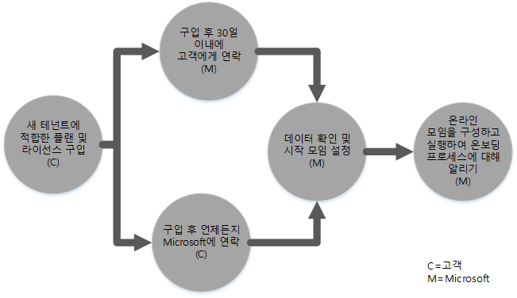
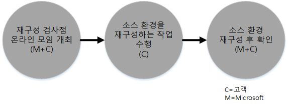
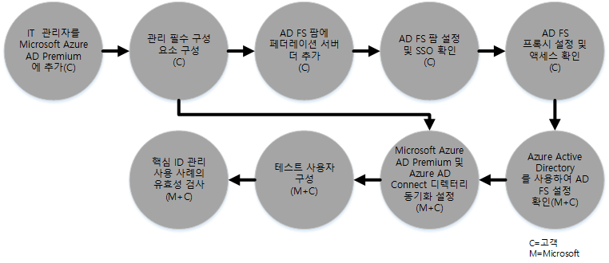

# Azure Active Directory Premium에 대한 FastTrack 센터 혜택 프로세스 
Microsoft Azure AD Premium의 FastTrack 센터 혜택에 대한 자격을 갖춘 조직의 사용자는 Microsoft 전문가와 원격으로 협업하여 Microsoft Azure AD Premium 환경을 사용할 수 있도록 준비할 수 있습니다. 귀사가 자격이 있는지 알아보려면 [Azure Active Directory Premium에 대한 FastTrack 센터 혜택](../Topic/FastTrack_Center_Benefit_for_Azure_Active_Directory_Premium.md)을 참조하세요.

이 문서에서는 다음을 제공합니다.

-   [Overview of the onboarding process](#overview)

-   [Expectations for your source environment](#expectations_src_environ)

-   [Phases of the onboarding process](#phases_onboarding_process)

-   각 단계에 대한 [Microsoft responsibilities](#microsoft_responsibilities)

-   각 단계에 대한 [Your responsibilities](#your_responsibilities)

등록이 완료되면 기대할 수 있는 혜택은 다음과 같습니다.

-   Microsoft Azure AD Premium 테넌트가 만들어집니다.

-   사용 허가를 받은 사용자는 다음 ID 옵션 중 하나를 사용하여 Microsoft Azure AD Premium 서비스에 액세스할 수 있습니다.

    -   클라우드 ID(고유한 Microsoft Azure AD Premium 계정)

    -   동기화된 ID: 단일 포리스트 또는 다중 Active Directory 포리스트를 사용하는 고객에 대해 Azure Active Directory Connect 도구로 온-프레미스 Active Directory에서 동기화되는 Microsoft Azure AD Premium 계정

    -   다음 Microsoft Azure AD Premium 계정이 포함된 페더레이션 ID:

        -   단일 Active Directory 포리스트 구성을 사용하는 고객에 대해 Microsoft Azure AD Connect 도구로 Active Directory에서 동기화됨

        -   온-프레미스 Active Directory에서 AD FS(Active Directory Federation Services) 2.0 이상으로 페더레이션

## 등록 프로세스 개요
등록의 두 가지 주요 구성 요소는 다음과 같습니다.

-   **코어 기능** - 테넌트 구성 및 경우에 따라 Azure AD와의 통합에 필요한 작업입니다. 코어 기능은 적격한 다른 Microsoft Online 서비스를 등록하는 데 필요한 기준을 제공하기도 합니다.

-   **서비스 등록** - Microsoft Azure AD Premium 독립 실행형 구성에 필요하거나 Azure AD Connect 디렉터리 동기화 또는 AD FS에 필요한 작업

다음 다이어그램에는 FastTrack 센터 혜택의 사용에 관한 타임라인을 설명합니다.

기본 프로세스는 다음과 같습니다.

-   Microsoft에서 적격 플랜을 구매한 날짜로부터 30일 이내에 연락드립니다. 조직이 이러한 서비스를 배포할 준비가 되어 있는 경우 [FastTrack 센터](http://fasttrack.microsoft.com/)에서 지원을 요청할 수도 있습니다. 지원을 요청하려면 FastTrack 센터(http://fasttrack.microsoft.com)에 로그인해 대시보드로 이동하고, 회사 이름을 선택하고, [신청] 탭을 클릭한 다음 적격 서비스에 대한 지원 요청 단추를 클릭합니다. 등록 지원이 시작되면 Microsoft는 온라인 모임 일정을 설정합니다.

-   Microsoft 팀이 코어 기능을 지원해 드린 후 각 적격 서비스에 대한 등록을 한 번씩 도와 드립니다.

모든 등록 지원은 Microsoft 직원 담당자가 원격으로 제공합니다.

-   Microsoft는 도구, 설명서 및 지침을 함께 사용하여 다양한 등록 작업을 원격으로 지원합니다. Microsoft에서 특정 구성 작업을 수행하기를 원하는 경우 이러한 작업을 수행하기 위해 Microsoft에 적절한 액세스 및 권한 제공을 선택할 수 있습니다.

-   등록 지원은 FastTrack 센터에서 제공하며 지정된 지역의 정상 업무 시간 동안 이용할 수 있습니다.

-   등록 지원은 중국어(번체), 영어, 프랑스어, 독일어, 이탈리아어, 일본어, 포르투갈어(브라질), 스페인어로 제공됩니다.

-   Microsoft 팀은 사용자나 사용자의 담당자와 직접 협업할 수 있습니다.

## 원본 환경에 대한 기대
단일 콘솔에서 풍부한 ID 관리를 활용하는 것에 대해 Microsoft Azure AD Premium과 통합하기를 원하는 원본 환경에 Microsoft Active Directory 온-프레미스가 이미 있을 수도 있습니다. FastTrack 혜택을 통해 Microsoft Azure AD Premium을 기존 온-프레미스 구현으로 통합하는데 도움을 제공합니다. 통합이 필요한 경우 원본 환경이 해당 응용 프로그램에 대해 최소 수준이어야 합니다.

다음 표에서는 기존 원본 환경에서 등록에 대해 기대되는 사항을 보여 줍니다.

|활동|원본 환경 기대|
|------|------------|
|핵심 기능|기능적 포리스트 수준이 Windows Server 2008 이상으로 설정되어 있고 다음 포리스트 구성을 사용하는 Active Directory 포리스트:  -   단일 Active Directory 포리스트 -   다중 Active Directory 포리스트 **Note:** 모든 다중 포리스트 구성의 경우 AD FS 배포는 FastTrack 센터 혜택의 범위에 속하지 않습니다.|
|서비스 등록  -   Microsoft Azure AD Premium|온-프레미스 Active Directory 및 환경은 Azure AD Premium을 위해 준비되어 있으며, Azure AD 및 Azure AD Premium 기능과의 통합을 방지하는 식별된 문제 수정이 포함되어 있습니다.|

## 등록 프로세스의 단계
Microsoft Azure AD Premium 등록에는 다음 그림에 표시된 것처럼 5가지 주요 단계가 있습니다.

-   시작

-   평가

-   수정

-   사용

-   닫기

각 단계의 자세한 작업은 [Microsoft responsibilities](#microsoft_responsibilities) 및 [Your responsibilities](#your_responsibilities) 섹션을 참조하세요.

### 시작 단계
적절한 수량의 라이선스를 구매한 후 구매 확인 메일의 지침에 따라 라이선스를 기존 테넌트나 새 테넌트에 연결하세요. Microsoft에서 FastTrack 센터 혜택 자격을 갖추고 있는지 확인합니다. Microsoft에서 적격 플랜을 구매한 날짜로부터 30일 이내에 연락드립니다. 조직이 이러한 서비스를 배포할 준비가 되어 있는 경우 [FastTrack 센터](http://fasttrack.microsoft.com/)에서 지원을 요청할 수도 있습니다. 지원을 요청하려면 FastTrack 센터(http://fasttrack.microsoft.com)에 로그인해 대시보드로 이동하고, 회사 이름을 선택하고, [신청] 탭을 클릭한 다음 적격 서비스에 대한 지원 요청 단추를 클릭합니다. 등록 지원이 시작되면 Microsoft는 온라인 모임 일정을 설정합니다.

이 단계에서 Microsoft는 등록 프로세스를 논의하고, 데이터를 확인하고, 준비 모임 일정을 정합니다.

### 평가 단계
등록 프로세스가 시작되면 Microsoft는 사용자와 협업하여 원본 환경 및 요구 사항을 평가합니다. 환경을 평가하기 위한 도구가 실행되고 Microsoft는 사용자가 온-프레미스 Active Directory, 인터넷 브라우저, 클라이언트 장치의 운영 체제, DNS, 네트워크, 인프라 및 ID 시스템을 평가하여 등록을 위해 변경해야 하는 내용이 있는지 확인하는 과정을 안내합니다. Microsoft는 사용자의 현재 설정을 기준으로 하여 Microsoft Azure AD Premium에 등록하기 위한 최소 요구 사항에 부합하도록 원본 환경을 업그레이드하는 수정 플랜을 제공합니다. 또한 수정 단계를 위한 검사점 호출도 적절히 설정합니다.

### 수정 단계
필요한 경우 각 서비스를 등록하기 위한 요구 사항을 충족하도록 원본 환경에서 수정 플랜의 작업을 수행합니다.

활성화 단계를 시작하기 전에 Microsoft는 수정 작업의 결과를 공동으로 확인하여 다음 단계를 진행할 준비가 되었는지 확인합니다.

### 활성화 단계
수정 작업이 모두 완료되면 프로젝트는 서비스 사용을 위한 핵심 인프라 구성 및 Microsoft Azure AD Premium 프로비저닝으로 전환됩니다.

**활성화 단계 - 핵심 기능**

핵심 기능 활성화에는 서비스 프로비저닝과 테넌트 및 ID 통합이 포함됩니다. 여기에는 Microsoft Azure AD Premium을 등록하기 위한 기반으로 제공하는 단계도 포함됩니다.

Microsoft Azure AD Premium 등록은 코어 등록이 완료되면 시작할 수 있습니다.

**활성화 단계 - Microsoft Azure AD Premium**

Microsoft Azure AD Premium 환경에서는 필요에 따라 Azure AD Connect 디렉터리 동기화 및 AD FS(Active Directory Federation Services)에서 설정할 수 있습니다.

온-프레미스 ID를 클라우드에 동기화를 포함하는 Microsoft Azure AD Premium 시나리오의 경우 IT 관리자와 사용자 추가, 관리 사전 요구 사항 구성, Microsoft Azure AD Premium 설정, Azure AD Connect를 사용하는 디렉터리 동기화 및 Azure AD Connect를 사용하는 Active Directory Federation Services 설정, 테스트 사용자 구성 및 해당 서비스에 대한 핵심 사용 케이스를 확인을 제공하여 사용자를 돕습니다.

Microsoft Azure AD Premium 설치에는 다음과 같은 기능을 사용하도록 설정하는 것이 포함됩니다.

-   SSPR(셀프 서비스 암호 재설정)

-   Azure MFA(Multi-Factor Authentication)

-   SaaS(Software as a Service) 응용 프로그램 - 하나의 SaaS 응용 프로그램을 설정합니다.

-   SSGM(셀프 서비스 그룹 관리)

-   관리 보고서

## Microsoft의 책임

### 일반

-   자세한 단계 설명에 나와 있는 필수 구성 작업에 대한 원격 지원을 제공합니다.

-   사용 가능한 설명서와 소프트웨어 도구, 관리 콘솔 및 스크립트를 제공하여 구성 작업을 줄이거나 없앨 수 있도록 도와줍니다.

FastTrack 센터 혜택을 사용하기 위해 Microsoft에 액세스 권한과 사용 권한을 제공할 필요는 없습니다. 경우에 따라 Microsoft에 특정 작업을 대신 수행할 수 있는 적절한 액세스 및 권한을 제공할 수 있습니다.

### 시작 단계

-   새 테넌트에 대한 적격 라이선스 구매일로부터 30일 이내에 사용자에게 연락합니다.

-   적격 라이선스 구매일로부터 90일 이내에 사용자와 협업하여 등록을 시작합니다.

-   등록할 적격 서비스를 정의합니다.

### 평가 단계

-   관리 개요를 제공합니다.

-   다음에 대한 지침을 제공합니다.

    -   DNS, 네트워크 및 인프라 요구 사항.

    -   클라이언트 요구 사항(인터넷 브라우저, 클라이언트 운영 체제 및 서비스 요구 사항).

    -   사용자 ID 및 프로비저닝.

    -   디렉터리 동기화 요구 사항 식별.

    -   암호 해시 동기화가 고객 목표를 충족 하는 경우 또는 AD FS가 필요한 경우를 결정.

    -   이미 구매되었으며 등록의 일부로 정의된 적격 서비스 활성화.

    -   계정 테스트, SaaS 응용 프로그램(예: SalesForce) 인스턴스 테스트와 같은 필요한 파일럿 및 테스트 환경 요구 사항을 식별.

-   수정 작업에 대한 타임라인을 설정합니다.

-   수정 검사 목록을 제공합니다.

### 수정 단계

-   합의된 일정에 따라 전화 회의를 열어 수정 작업의 진행률을 검토합니다.

-   도구를 실행하여 문제를 식별 및 해결하고 결과를 해석하는 과정을 지원합니다.

### 활성화 단계
다음에 대한 지침을 제공합니다.

-   Microsoft Azure AD Premium 테넌트 활성화.

-   방화벽 포트 구성.

-   적격 서비스에 대한 DNS 구성.

-   Microsoft Azure AD Premium 서비스에 대한 연결의 유효성 검사.

-   단일 포리스트 환경의 경우:

    -   필요한 경우 AD DS(Active Directory 도메인 서비스) 및 Azure AD Connect 간의 디렉터리 동기화 설치.

    -   Azure AD Connect 도구를 사용하여 암호 동기화 구성.

-   다중 포리스트 환경의 경우:

    -   Azure AD Connect 동기화를 설치하고, 다중 포리스트 시나리오에 대해 설정합니다. 암호 해시 동기화 및 비밀번호 쓰기 저장은 다중 포리스트를 지원합니다.  그러나 다른 쓰기 저장 시나리오는 지원되지 않습니다.

    -   온-프레미스 Active Directory 포리스트와 Microsoft Azure AD Premium 디렉터리(Azure Active Directory) 간의 동기화 구성.

        > [!NOTE]
        > 사용자 지정 규칙 확장의 개발 및 구현은 범위에 속하지 않습니다.

-   대상이 페더레이션 ID일 때의 단일 포리스트: 필요한 경우 단일 사이트 내결함성 구성에서 Microsoft Azure AD Premium을 사용한 로컬 도메인을 인증하는 데 필요한 AD FS(Active Directory Federation Services)를 설치 및 구성합니다.

    > [!NOTE]
    > 모든 다중 포리스트 구성의 경우, AD FS 배포는 범위에 속하지 않습니다.

-   배포한 경우 SSO(Single Sign-On) 기능 테스트.

#### 활성화 단계 - Azure AD Premium(Azure AD Connect 및 AD FS 포함)
설정에 대한 지침을 제공 합니다.

-   라이선스를 포함한 사용자 프로비저닝.

-   Azure AD Connect 디렉터리 동기화(비밀번호 쓰기 저장 및 암호 해시 동기화).

-   AD FS(Active Directory Federation Services).

-   SSPR(셀프 서비스 암호 재설정)

-   Azure MFA(Multi-Factor Authentication).

-   SaaS 응용 프로그램용 Single Sign-On을 포함할 수 있는 하나의 통합 응용 프로그램.

-   관리자를 위한 사용량 및 보안 보고서.

-   SSGM(셀프 서비스 그룹 관리).

-   응용 프로그램 프록시.

-   관리자 알림.

-   사용자 지정된 로그온 화면(로고, 텍스트 및 이미지 포함)

## 사용자의 책임
이 섹션에서는 등록 프로세스에서 사용자에게 책임이 있는 몇 가지 사항에 대해 설명합니다.

### 일반

-   이 문서에 열거된 구성 가능한 옵션을 벗어나는 Microsoft Azure AD Premium 테넌트에 대한 향상된 기능 및 통합.

-   사용자의 리소스에 대한 전체 프로그램 및 프로젝트 관리.

-   최종 사용자 통신, 설명서, 교육 및 변경 관리.

-   기술 지원팀 설명서 및 교육.

-   사용자 조직과 관련된 보고서, 프레젠테이션 또는 회의록 작성.

-   사용자 조직과 관련된 아키텍처 및 기술 설명서 작성.

-   하드웨어 및 네트워킹 설계, 확보, 설치 및 구성.

-   소프트웨어 확보, 설치 및 구성.

-   Microsoft Azure AD Premium 서비스 초기 구성 및 기능 테스트를 위해 만든 것 이상의 보안 정책을 관리, 구성 및 적용.

-   Microsoft Azure AD Premium 서비스 초기 구성 및 기능 테스트에 사용되는 것 이상의 사용자 계정을 등록.

-   네트워크 구성, 분석, 대역폭 유효성 검사, 테스트 및 모니터링.

-   기술 변경 관리 승인 프로세스 관리 및 지원 설명서 작성.

-   운영 모델 및 운영 가이드 수정.

-   온-프레미스 Multi-Factor Authentication 설정.

-   이전에 고객에 의해 사용된 서비스 및 원본 환경을 제거 및 해제.

-   테스트 환경 구축 및 유지 관리.

-   인프라 서버에 서비스 팩 및 기타 필수 업데이트 설치.

-   공용 SSL 인증서 제공 및 구성.

-   최종 사용자가 소유하는 장치에 구성되고 표시될 조직의 TOU(사용 약관) 문을 작성.

### 시작 단계

-   Microsoft 팀과 협력하여 적격 서비스를 등록합니다.

-   참여 준비 모임에 참가하고, 조직의 참가자를 관리 및 안내하고, 수정 타임라인을 확인합니다.

### 평가 단계

-   필요한 평가 작업을 완료하기 위해 적합한 관련자(프로젝트 관리자 포함)를 식별합니다.

-   (선택 사항) 사용 중인 환경이나 Microsoft Azure AD Premium 구독에 대해 평가 도구를 실행할 때 지침이 필요한 경우 사용자의 화면을 Microsoft와 공유합니다.

-   수정 검사 목록을 만들고 인프라, 네트워크, 관리, 디렉터리 동기화 준비, 네트워크 보안 및 페더레이션 ID 항목을 비롯한 전체 플랜 작업에 기여하는 모임에 참여합니다.

-   모임에 참여하여 사용자 프로비저닝 방법을 설명합니다.

-   모임에 참여하여 온라인 서비스 구성을 계획합니다.

-   마이그레이션 준비를 위한 지원 플랜을 만듭니다.

### 수정 단계

-   평가 단계에서 파악된 수정 작업을 완료하는 데 필요한 단계를 수행합니다.

-   검사점 모임에 참여합니다.

### 활성화 단계

-   (선택 사항) 사용 중인 환경이나 Microsoft Azure AD Premium 구독에 대해 변경할 때 지침이 필요한 경우 사용자의 화면을 Microsoft와 공유합니다.

-   리소스를 적절하게 관리합니다.

-   Microsoft의 지침에 따라 네트워크 관련 항목을 구성합니다.

-   Microsoft의 지침에 따라 디렉터리 준비 작업을 진행하고 디렉터리 동기화를 구성합니다.

-   Microsoft의 지침에 따라 보안 관련 인프라(방화벽 포트 등)를 구성합니다.

-   적절한 클라이언트 인프라를 구현합니다.

-   Microsoft의 지침에 따라 사용자 프로비저닝 접근 방식을 구현합니다.

-   Microsoft의 지침에 따라 다양한 서비스를 사용하도록 설정합니다.

## 더 자세한 내용을 원하세요?
[Microsoft Azure Active Directory](http://azure.microsoft.com/en-us/documentation/services/active-directory/) 및 [Enterprise Mobility Suite](http://www.microsoft.com/en-us/server-cloud/products/enterprise-mobility-suite/default.aspx)를 참조하세요.

