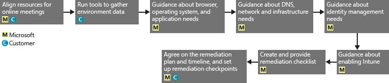

# Intune에 대한 FastTrack 센터 혜택 프로세스
Microsoft Intune 서비스 혜택에 대해 자격을 갖춘 조직의 사용자는 Microsoft 전문가와 원격으로 협업하여 Microsoft Intune 환경을 사용할 수 있도록 준비할 수 있습니다.

Microsoft Intune은 Microsoft의 EMS(Enterprise Mobility Suite)에 속해 있습니다. 이 EMS는 MDM(모바일 장치 관리) 및 MAM(모바일 응용 프로그램 관리)을 포함하는 EMM(엔터프라이즈 이동성 관리) 기능을 제공합니다.  Microsoft Intune을 사용하면 직원이 모바일 장치에서 장치를 프로비전하고 장치를 구성하고 모바일 앱을 배포하여 생산성을 높이도록 할 수 있습니다.  또한 장치 규정 준수를 모니터링하고 모바일 응용 프로그램 및 데이터를 보호하고 Azure AD와의 통합을 통해 회사 서비스에 대한 액세스를 제어하여 회사 데이터를 보호하는 데에도 Microsoft Intune을 사용할 수 있습니다.

귀사가 자격이 있는지 알아보려면 [Intune에 대한 FastTrack 센터 혜택](../Topic/FastTrack_Center_Benefit_for_Intune.md)을 참조하세요. 다른 Enterprise Mobility Suite 서비스에 대한 환경 준비에 관심이 있다면 [Enterprise Mobility Suite에 대한 FastTrack 센터 혜택](../Topic/FastTrack_Center_Benefit_for_Enterprise_Mobility_Suite.md)을 참조하세요.

**Office 365용 Microsoft FastTrack에 대한 정보를 찾고 있습니까?**  [Office 365에 대한 FastTrack 센터 혜택](https://technet.microsoft.com/library/office-365-onboarding-benefit.aspx)을 확인하세요.

이 문서에서는 Microsoft Intune의 서비스 혜택에 대한 다음 정보를 제공합니다.

-   [Overview of the onboarding process](#overview_onboarding_process)

-   [Expectations for your source environment](#expectations_src_environ)

-   [Phases of the onboarding process](#phases_onboarding_process)

-   각 단계에 대한 [Microsoft responsibilities](#microsoft_responsibilities)

-   각 단계에 대한 [Your responsibilities](#your_responsibilities)

등록이 완료되면 기대할 수 있는 혜택은 다음과 같습니다.

-   Microsoft 온라인 서비스 테넌트가 만들어집니다.

-   사용 허가를 받은 사용자는 다음 ID 옵션 중 하나를 사용하여 Microsoft Intune 서비스에 액세스할 수 있습니다.

    -   클라우드 ID(고유한 Microsoft 온라인 서비스 계정).

    -   동기화된 ID: Azure Active Directory Connect와 온-프레미스 Active Directory에서 동기화된 Microsoft Intune 계정(동기화 서비스):

        -   단일 Active Directory 포리스트 환경을 사용하는 고객

        -   지원되는 다중 포리스트 Active Directory 토폴로지를 사용하는 고객

-   페더레이션 ID--Microsoft Intune 계정:

    -   단일 Active Directory 포리스트 구성을 사용하는 고객 또는 단일 Active Directory 계정 포리스트("로그온 포리스트"라고도 함) 및 단일 Active Directory 리소스 포리스트 구성을 사용하는 고객에 대해 Microsoft Azure Active Directory Connect 도구를 사용하여 Active Directory에서 동기화됨

    -   온-프레미스 Active Directory에서 Windows Server 2012 R2 Active Directory Federation Services 역할로 페더레이션 또는 온-프레미스 Active Directory에서 AD FS(Active Directory Federation Services) 2.0 이상으로 페더레이션

## 등록 프로세스 개요
등록의 두 가지 주요 구성 요소는 다음과 같습니다.

-   **코어 기능** - 테넌트 구성 및 경우에 따라 Azure AD와의 통합에 필요한 작업입니다. 핵심 기능 구성 요소는 적격한 다른 서비스 등록의 기준을 제공하기도 합니다.

-   **서비스 등록** - Microsoft Intune을 구성하는 데 필요한 작업입니다.

다음 다이어그램에서는 FastTrack 센터 혜택의 사용에 관한 이벤트 시퀀스를 설명합니다.

기본 프로세스는 다음과 같습니다.

-   대상 요금제를 구매한 날짜로부터 30일 이내에 FastTrack 센터에서 연락을 드립니다. 조직에 이러한 서비스를 배포할 준비가 되어 있는 경우 [FastTrack 센터](http://fasttrack.microsoft.com/)에서 지원을 요청할 수도 있습니다. 지원을 요청하려면 [FastTrack 센터](http://fasttrack.microsoft.com/)에 로그인하고 대시보드로 이동하여 회사 이름을 선택한 다음 Offers(신청) 탭을 클릭하고 Request Assistance(지원 요청) 단추를 클릭하여 Microsoft Intune, Azure Active Directory Premium 또는 Azure Rights Management Premium에 대한 지원을 요청합니다.

-   FastTrack 센터에서 코어 기능을 도와 드린 다음 각 대상 서비스에 대해 한 번씩 등록하도록 도와 드립니다.

모든 등록 지원은 Microsoft 직원 담당자가 원격으로 제공합니다.

-   Microsoft는 도구, 설명서 및 지침을 함께 사용하여 다양한 등록 작업을 원격으로 지원합니다.

-   등록 지원은 FastTrack 센터에서 제공하며 지정된 지역의 정상 업무 시간 동안 이용할 수 있습니다.

-   등록 지원은 중국어(번체), 영어, 프랑스어, 독일어, 이탈리아어, 일본어, 포르투갈어(브라질), 스페인어로 제공됩니다.

-   Microsoft 팀은 사용자나 사용자의 담당자와 직접 협업할 수 있습니다.

## 원본 환경에 대한 기대
Microsoft Intune 서비스로 전환하거나 이 서비스와 통합하려는 원본 환경에 서비스가 이미 있을 수 있습니다. 일부 서비스의 경우 원본 환경과의 일정 수준 통합을 설정하는 작업에 대한 지원이 Intune에 대한 FastTrack센터 혜택에 포함됩니다. 통합이 필요한 경우 원본 환경이 해당 응용 프로그램에 대해 최소 수준이어야 합니다.

다음 표에서는 기존 원본 환경에서 등록에 대해 기대되는 사항을 보여 줍니다.

|활동|원본 환경 기대|
|------|------------|
|핵심 기능|기능적 포리스트 수준이 Windows Server 2008 이상으로 설정되어 있고 다음 포리스트 구성을 사용하는 Active Directory 포리스트:  -   단일 Active Directory 포리스트 -   다중 Active Directory 포리스트 **Note:** 모든 다중 포리스트 구성의 경우 AD FS 배포는 FastTrack 센터 혜택의 범위에 속하지 않습니다.|
|서비스 등록  -   Microsoft Intune -   System Center Configuration Manager와 통합된 Microsoft Intune|IT 관리자는 Microsoft Intune과 연결된 System Center Configuration Manager 2012 R2 이상 버전을 사용하여 장치를 관리하려면 [관리자 검사 목록: Microsoft Intune을 사용하여 모바일 장치를 관리하도록 Configuration Manager 구성](https://technet.microsoft.com/library/jj943763.aspx)을 따라야 합니다. **Note:** 서비스 혜택에는 System Center Configuration Manager와 통합된 Microsoft Intune에 필요한 최소 요구 사항에 맞게 System Center Configuration Manager를 설정 또는 업그레이드하기 위한 지원은 포함되어 있지 않습니다.|

## 등록 프로세스의 단계
등록은 다음과 같이 크게 네 가지 단계로 구성됩니다.

-   시작

-   평가

-   수정

-   사용

각 단계의 자세한 작업은 [Microsoft responsibilities](#microsoft_responsibilities) 및 [Your responsibilities](#your_responsibilities) 섹션을 참조하세요.

### 시작 단계
적절한 유형의 라이선스를 적절한 수량만큼 구매한 후 구매 확인 메일의 지침에 따라 라이선스를 기존 테넌트나 새 테넌트에 연결하세요. FastTrack 센터에서는 귀사가 서비스 혜택을 받을 대상을 갖추고 있는지 확인합니다. 대상 요금제를 구매한 날짜로부터 30일 이내에 Microsoft에서 연락을 드립니다. 조직에 이러한 서비스를 배포할 준비가 되어 있는 경우 [FastTrack 센터](http://fasttrack.microsoft.com/)에서 지원을 요청할 수도 있습니다. 지원을 요청하려면 [FastTrack 센터](http://fasttrack.microsoft.com/)에 로그인하고 대시보드로 이동하여 회사 이름을 선택한 다음 Offers(신청) 탭을 클릭하고 Request Assistance(지원 요청) 단추를 클릭하여 Microsoft Intune, Azure Active Directory Premium 또는 Azure Rights Management Premium에 대한 지원을 요청합니다.

이 단계에서 Microsoft는 등록 프로세스를 논의하고, 데이터를 확인하고, 준비 모임 일정을 정합니다.

### 평가 단계
등록 프로세스가 시작되면 Microsoft는 사용자와 협업하여 원본 환경 및 요구 사항을 평가합니다. 환경을 평가하기 위한 도구가 실행되고 Microsoft는 사용자가 인터넷 브라우저, 클라이언트 운영 체제, DNS, 네트워크, 인프라 및 ID 시스템을 평가하여 등록을 위해 변경해야 하는 내용이 있는지 확인하는 과정을 안내합니다. Microsoft는 사용자의 현재 설정을 기준으로 하여 Microsoft Intune에 등록하기 위한 최소 요구 사항에 부합하도록 원본 환경을 업그레이드하는 수정 플랜을 제공합니다. 또한 수정 단계를 위한 검사점 호출도 적절히 설정합니다.

### 수정 단계
필요한 경우 각 서비스를 등록하기 위한 요구 사항을 충족하도록 원본 환경에서 수정 플랜의 작업을 수행합니다.

활성화 단계를 시작하기 전에 Microsoft는 수정 작업의 결과를 공동으로 확인하여 다음 단계를 진행할 준비가 되었는지 확인합니다.

### 활성화 단계
수정 작업이 모두 완료되면 프로젝트는 서비스 사용을 위한 핵심 인프라 구성 및 Microsoft Intune 프로비저닝으로 전환됩니다.

**활성화 단계 - 핵심 기능**

핵심 기능 활성화에는 서비스 프로비저닝과 테넌트 및 ID 통합이 포함됩니다. 여기에는 Microsoft Intune을 등록하기 위한 기반으로 제공하는 단계도 포함됩니다.

Microsoft intune 등록은 핵심 기능 활성화가 완료되면 시작할 수 있습니다.

**활성화 단계 – Microsoft Intune**

Microsoft Intune의 경우 Microsoft는 사용자의 모바일 장치 및 모바일 응용 프로그램 관리 요구 사항에 따라 Microsoft Intune을 사용하여 장치를 관리할 수 있도록 준비하는 과정을 안내합니다. 정확한 단계는 원본 환경에 따라 다르며 다음 작업이 포함될 수 있습니다.

-   최종 사용자 라이선싱. 필요한 경우 Microsoft 클라우드 서비스 테넌트에 대한 볼륨 라이선스를 활성화하는 방법의 지원도 제공합니다.

-   온-프레미스 Active Directory 또는 클라우드 ID를 활용하여 Microsoft Intune에서 사용할 ID 구성.

-   Microsoft Intune 구독에 사용자 추가, IT 관리자 역할 정의 및 사용자와 장치 그룹 만들기.

-   관리 요구 사항에 따라 다음과 같이 모바일 장치 관리 기관 구성.

    -   Microsoft Intune이 유일한 MDM 솔루션이거나 Office 365용 모바일 장치 관리와 함께 사용되는 경우 Microsoft Intune을 MDM 기관으로 설정합니다.

    -   System Center Configuration Manager의 기존 구현이 있고 Microsoft Intune으로 관리 기능을 확장하려는 경우 Configuration Manager를 MDM 기관으로 설정합니다.

        > [!NOTE]
        > 최종 사용자 소유 장치, 공유 장치 또는 키오스크 유형 장치에서만 모바일 응용 프로그램 관리를 활용하려는 경우 MDM 기관을 설정할 필요가 없습니다.

-   모바일 장치 관리가 범위에 포함되는 경우 다음과 관련된 지침을 제공합니다.

    -   MDM 관리 정책의 유효성을 검사하는 데 사용할 테스트 그룹 구성.

    -   다음과 같은 MDM 관리 정책 및 서비스 구성.

        -   지원되는 각 플랫폼에 대해 웹 링크 또는 딥 링크를 통한 응용 프로그램 배포.

        -   조건부 액세스 정책.

        -   메일 프로필 배포.

        -   해당되는 경우 Microsoft Intune Exchange Connector 설정.

    -   [지원되는 각 플랫폼](https://technet.microsoft.com/library/dn600287.aspx)에 대해 최대 2대의 테스트 장치를 Microsoft Intune 또는 Configuration Manager with Microsoft Intune에 등록.

    -   소프트웨어 및 하드웨어 인벤토리 보고서 사용.

-   MAM(모바일 응용 프로그램 관리)이 범위에 포함된 경우나 기존 Microsoft 또는 타사 MDM 솔루션을 MAM 정책으로 보완하려는 경우 Microsoft는 다음과 관련된 지침을 제공합니다.

    -   지원되는 각 플랫폼에 대한 MAM 정책 구성.

    -   관리되는 앱에 대한 조건부 액세스 정책 구성.

    -   위의 MAM 정책에서 적절한 사용자 그룹을 대상으로 지정.

    -   관리되는 응용 프로그램 사용 현황 보고서 사용.

-   PC 관리가 범위에 포함되는 경우 다음과 관련된 지침을 제공합니다.

    -   필요한 경우 Intune 클라이언트 소프트웨어 설치.

    -   Intune에서 사용할 수 있는 소프트웨어 및 하드웨어 보고서 사용.

## Microsoft의 책임
이 섹션에서는 등록 프로세스에서 Microsoft에 책임이 있는 몇 가지 사항에 대해 설명합니다.

### 일반

-   자세한 단계 설명에 나와 있는 필수 구성 작업에 대한 원격 지원을 제공합니다.

-   사용 가능한 설명서와 소프트웨어 도구, 관리 콘솔 및 스크립트를 제공하여 구성 작업을 줄이거나 없앨 수 있도록 도와줍니다.

### 시작 단계

-   새 테넌트에 대한 적격 라이선스 구매일로부터 30일 이내에 사용자에게 연락합니다.

-   등록을 시작할 수 있도록 협업합니다.

-   등록할 적격 서비스를 정의합니다.

### 평가 단계

-   관리 개요를 제공합니다.

-   다음에 대한 지침을 제공합니다.

    -   DNS, 네트워크 및 인프라 요구 사항.

    -   클라이언트 요구 사항(인터넷 브라우저, 클라이언트 운영 체제 및 서비스 요구 사항).

    -   사용자 ID 및 프로비저닝.

    -   이미 구매되었으며 등록의 일부로 정의된 적격 서비스 활성화.

-   수정 작업에 대한 타임라인을 설정합니다.

-   수정 검사 목록을 제공합니다.

### 수정 단계

-   합의된 일정에 따라 전화 회의를 열어 수정 작업의 진행률을 검토합니다.

-   도구를 실행하여 문제를 식별 및 해결하고 결과를 해석하는 과정을 지원합니다.

### 활성화 단계
다음에 대한 지침을 제공합니다.

-   Microsoft 온라인 서비스 테넌트 활성화.

-   TCP/IP 프로토콜 및 방화벽 포트 구성.

-   적격 서비스에 대한 DNS 구성.

-   Microsoft 온라인 서비스에 대한 연결의 유효성 검사.

-   단일 포리스트 환경의 경우:

    -   필요한 경우 AD DS(Active Directory 도메인 서비스)와 적격 Microsoft 온라인 서비스 간의 디렉터리 동기화 서버 설치.

    -   Microsoft Intune(Azure Active Directory)과 Azure Active Directory Connect 도구의 암호 동기화(암호 해시) 구성.

        > [!NOTE]
        > 사용자 지정 규칙 확장의 개발 및 구현은 범위에 속하지 않습니다.

-   대상이 페더레이션 ID인 경우 단일 포리스트: 필요한 경우 단일 사이트 내결함성 구성에서 Microsoft Intune을 사용한 로컬 도메인 인증을 위해 AD FS(Active Directory Federation Services)설치 및 구성.

    > [!NOTE]
    > 모든 다중 포리스트 구성의 경우, AD FS 배포는 범위에 속하지 않습니다.

-   배포한 경우 SSO(Single Sign-On) 기능 테스트.

#### 활성화 단계 – Microsoft Intune
다음에 대한 지침을 제공합니다.

-   최종 사용자 라이선싱. 필요한 경우 Microsoft 클라우드 서비스 테넌트에 대한 볼륨 라이선스를 활성화하는 방법의 지원도 제공합니다.

-   온-프레미스 Active Directory 또는 클라우드 ID를 활용하여 Microsoft Intune에서 사용할 ID 구성.

-   Microsoft Intune 구독에 사용자 추가, IT 관리자 역할 정의 및 사용자와 장치 그룹 만들기.

-   관리 요구 사항에 따라 다음과 같이 모바일 장치 관리 기관 구성.

    -   Microsoft Intune이 유일한 MDM 솔루션이거나 Office 365용 모바일 장치 관리와 함께 사용되는 경우 Microsoft Intune을 MDM 기관으로 설정합니다.

    -   System Center Configuration Manager의 기존 구현이 있고 Microsoft Intune으로 관리 기능을 확장하려는 경우 Configuration Manager를 MDM 기관으로 설정합니다.

        > [!NOTE]
        > 최종 사용자 소유 장치, 공유 또는 키오스크 유형 장치에서만 모바일 응용 프로그램 관리를 활용하려는 경우 MDM 기관을 설정할 필요가 없습니다.

-   모바일 장치 관리가 범위에 포함되는 경우 다음과 관련된 지침을 제공합니다.

    -   MDM 관리 정책의 유효성을 검사하는 데 사용할 테스트 그룹 구성.

    -   다음과 같은 MDM 관리 정책 및 서비스 구성.

        -   지원되는 각 플랫폼에 대해 웹 링크 또는 딥 링크를 통한 응용 프로그램 배포.

        -   조건부 액세스 정책.

        -   메일 프로필 배포.

        -   해당되는 경우 Microsoft Intune Exchange Connector 설정.

    -   지원되는 각 플랫폼에 대해 최대 2대의 테스트 장치를 Microsoft Intune 또는 Configuration Manager with Microsoft Intune에 등록.

    -   하드웨어 및 소프트웨어 인벤토리 보고서 사용.

-   MAM(모바일 응용 프로그램 관리)이 범위에 포함된 경우 또는 기존 타사 MDM 솔루션을 MAM 정책으로 보완하려는 경우 다음과 관련된 지침을 제공합니다.

    -   지원되는 각 플랫폼에 대한 MAM 정책 구성.

    -   관리되는 앱에 대한 조건부 액세스 정책 구성.

    -   위의 MAM 정책에서 적절한 사용자 그룹을 대상으로 지정.

    -   관리되는 응용 프로그램 사용 현황 보고서 사용.

-   PC 관리가 범위에 포함되는 경우 다음과 관련된 지침을 제공합니다.

    -   필요한 경우 Intune 클라이언트 소프트웨어 설치.

    -   Intune에서 사용할 수 있는 소프트웨어 및 하드웨어 보고서 사용.

## 사용자의 책임
이 섹션에서는 등록 프로세스에서 사용자에게 책임이 있는 몇 가지 사항에 대해 설명합니다.

### 일반

-   이 문서에 열거된 구성 가능한 옵션을 벗어나는 Microsoft 온라인 서비스 테넌트에 대한 향상된 기능 및 통합

-   사용자의 리소스에 대한 전체 프로그램 및 프로젝트 관리.

-   최종 사용자 통신, 설명서, 교육 및 변경 관리.

-   기술 지원팀 설명서 및 교육.

-   사용자 조직과 관련된 보고서, 프레젠테이션 또는 회의록 작성.

-   사용자 조직과 관련된 아키텍처 및 기술 설명서 작성.

-   하드웨어 및 네트워킹 설계, 확보, 설치 및 구성.

-   소프트웨어 확보, 설치 및 구성.

-   Microsoft Intune에 필요한 클라이언트 소프트웨어 구성, 패키지 및 배포.

-   모바일 장치 활성화.

-   네트워크 구성, 분석, 대역폭 유효성 검사, 테스트 및 모니터링.

-   기술 변경 관리 승인 프로세스 관리 및 지원 설명서 작성.

-   사용자, 워크스테이션 및 서버 관리를 위한 그룹 정책 지정 및 정의.

-   운영 모델 및 운영 가이드 수정.

-   다단계 인증 설정.

-   기타 PC 또는 장치 관리 솔루션과 같은 원본 환경 제거 및 서비스 해제.

-   테스트 환경 구축 및 유지 관리.

-   인프라 서버에 서비스 팩 및 기타 필수 업데이트 설치.

-   공용 SSL 인증서 제공 및 구성.

-   최종 사용자가 액세스할 수 있는 Microsoft Intune 회사 포털에 구성 및 표시될 조직의 TOU(사용 약관) 작성.

### 시작 단계

-   Microsoft 팀과 협업하여 대상 서비스를 등록합니다.

-   참여 준비 모임에 참가하고, 조직의 참가자를 관리 및 안내하고, 수정 타임라인을 확인합니다.

### 평가 단계

-   필요한 평가 작업을 완료하기 위해 적합한 관련자(프로젝트 관리자 포함)를 식별합니다.

-   (선택 사항) 사용 중인 환경이나 Microsoft Intune 구독에 대해 평가 도구를 실행할 때 지침이 필요한 경우 사용자의 화면을 Microsoft와 공유합니다.

-   수정 검사 목록을 만들고 인프라, 네트워크, 관리, 디렉터리 동기화 준비, 네트워크 보안 및 페더레이션 ID 항목을 비롯한 전체 플랜 작업에 기여하는 모임에 참여합니다.

-   모임에 참여하여 사용자 프로비저닝 방법을 설명합니다.

-   모임에 참여하여 온라인 서비스 구성을 계획합니다.

-   마이그레이션 준비를 위한 지원 플랜을 만듭니다.

### 수정 단계

-   평가 단계에서 파악된 수정 작업을 완료하는 데 필요한 단계를 수행합니다.

-   검사점 모임에 참여합니다.

### 활성화 단계

-   (선택 사항) 사용 중인 환경이나 Microsoft 온라인 서비스 구독에 대해 변경 내용을 실행할 때 지침이 필요한 경우 사용자의 화면을 Microsoft와 공유합니다.

-   리소스를 적절하게 관리합니다.

-   Microsoft의 지침에 따라 네트워크 관련 항목을 구성합니다.

-   Microsoft의 지침에 따라 디렉터리 준비 작업을 진행하고 디렉터리 동기화를 구성합니다.

-   Microsoft의 지침에 따라 보안 관련 인프라(방화벽 포트 등)를 구성합니다.

-   적절한 클라이언트 인프라를 구현합니다.

-   Microsoft의 지침에 따라 사용자 프로비저닝 접근 방식을 구현합니다.

-   Microsoft의 지침에 따라 다양한 서비스를 사용하도록 설정합니다.

-   등록 시작일로부터 12개월 이내에 Microsoft와 협업하여 모든 적격 서비스의 등록을 완료합니다.

-   Microsoft Intune이 설치된 PC 또는 모바일 장치 관리를 사용하도록 설정한 경우 Microsoft Intune을 통해 관리 정책을 사용하도록 설정할 때 테스트 장치를 사용합니다. 테스트 장치를 사용할 수 없는 경우 고객은 백업해야 할 책임이 있으며, 필요에 따라 Microsoft Intune 활성화 단계 중에 사용되는 장치에서 모든 콘텐츠를 복원해야 합니다.

-   웹 링크 또는 딥 링크를 통해 배포될 수 있는 각 Microsoft Intune 지원 플랫폼에 대해 최대 2개의 응용 프로그램 선택.

-   Microsoft Intune 서비스 기준 구성 및 기능을 테스트하는 데 사용되는 정책을 벗어나는 보안 정책 관리, 구성 및 적용.

## 더 자세한 내용을 원하세요?
[Microsoft Intune](http://www.microsoft.com/en-us/server-cloud/products/microsoft-intune/default.aspx) 및 [Enterprise Mobility Suite](http://www.microsoft.com/en-us/server-cloud/products/enterprise-mobility-suite/default.aspx)를 참조하세요.

